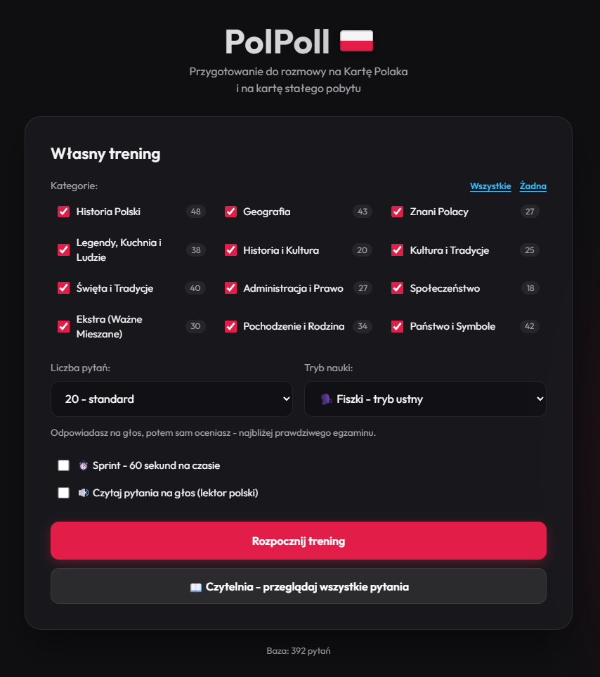
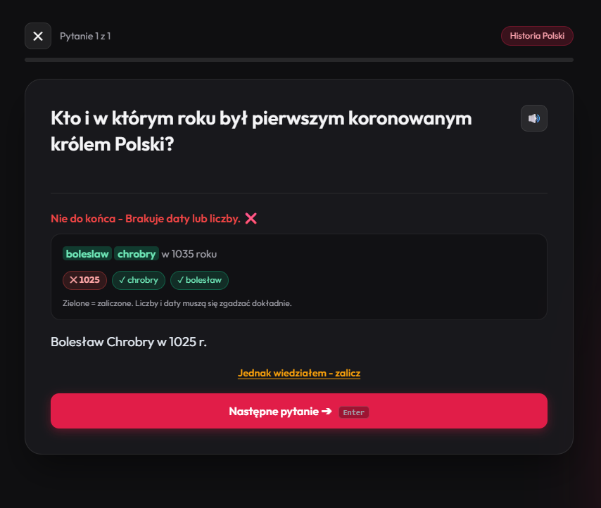

<div align="center">

# PolPoll 🇵🇱

**A trainer for the Karta Polaka and permanent-residence interviews**
**Trener do rozmowy na Kartę Polaka i kartę stałego pobytu**

392 questions · 5 study modes · spaced repetition · works offline

[**▶ Open the app / Otwórz aplikację**](https://oldvalencia.github.io/PolPoll/)

[](LICENSE)


**[English](#english) · [Polski](#polski)**



</div>

---

## English

### What it is

A study app for the interview that decides a Karta Polaka application, and for
the `zezwolenie na pobyt stały` (permanent residence) procedure. It covers Polish
history, geography, culture, holidays and the structure of the state — plus a
section on family and Polish descent, which is the first thing you get asked
when you apply through your roots.

Open the link, add it to your phone's home screen, use it without a connection.
Nothing to install, no account, no payment.

> **The app's interface is in Polish on purpose.** You will have to speak Polish
> at the interview, so it is better to get used to the language from day one.

### Study modes

| Mode | What it is for |
|---|---|
| 🗣️ **Fiszki** (flashcards) | Answer out loud, then grade yourself. Closest to the real interview |
| ⌨️ **Typing** | Checked against keywords. Typos are forgiven, **dates are not** |
| 🎯 **Quiz** | Four options. Wrong ones are drawn from questions of the same type, never at random |
| ⚖️ **True / False** | A snap decision — excellent for drilling dates and names |
| 👆 **Swipe** | One-handed: tap to flip the card, swipe sideways to grade it |
| ⏱️ **Sprint** | A modifier: 60 seconds, every mistake costs 2 |
| 📖 **Czytelnia** (reader) | Every question in one searchable, filterable list |

### How it teaches

**Dates are checked strictly.** Typing `1026` instead of `1025` is not accepted.
Half the exam is about years, and a trainer that confirms a wrong fact is worse
than no trainer at all.

**You see exactly what counted.** After each answer the matched words are
highlighted and the missing ones are listed. If the checker got it wrong, the
**"Jednak wiedziałem – zalicz"** button overrides the verdict and repairs your
statistics.

<div align="center">

</div>

**Spaced repetition (SM-2).** Every question carries its own interval: what you
know moves weeks away, what you keep missing comes back tomorrow. It runs
invisibly — a training set is always ordered from most overdue to best known.
Progress lives in the browser and is keyed to a stable question `id`, so it
survives updates to the question base.

**Personal questions are never auto-graded.** In the "Pochodzenie i Rodzina"
category the answers are templates you adapt to yourself ("My great-grandmother
[name] was born in [year] in [place]"). There is nothing to match against
keywords, so these always go through self-assessment.

### Accuracy

The interview decides an application, so facts get treated accordingly:

- questions whose answers change over time (president, prime minister, marshal
  of the Sejm, population) carry a **"sprawdź aktualność"** note — verify them
  before you apply;
- corrections are made against sources, not from memory. Already fixed: the
  Błędów Desert is anthropogenic rather than natural; the president may serve two
  terms in total (not "two in a row"); the Karta Polaka **loses validity** once
  its holder is granted permanent residence.

Found a mistake? [Open an issue](https://github.com/OldValencia/PolPoll/issues) —
that is the single most valuable contribution to this project.

### Install on a phone

**iPhone:** open the link in Safari → Share → *Add to Home Screen*.
**Android:** open in Chrome → menu → *Install app*.

It works offline afterwards.

<details>
<summary>If questions are not read aloud on iPhone</summary>

Check the side ring/silent switch — it mutes speech synthesis. If that is not it,
install a Polish voice:
*Settings → Accessibility → Spoken Content → Voices → Polish*.
</details>

### Running it locally

Vanilla HTML/CSS/JS, no build step and no dependencies. Any static server will
do — a `file://` URL will not register the service worker.

```bash
git clone https://github.com/OldValencia/PolPoll.git
cd PolPoll
python -m http.server 8000
# open http://localhost:8000
```

### Adding or fixing questions

`questions.js` is **generated** — editing it directly is pointless, your changes
will be overwritten. The source of truth is the plain-text files in `sources/`:

```
1. Kiedy i kto przyjął chrzest Polski?
Odpowiedź: W 966 r. książę Mieszko I.

2. Jakie miasto było pierwszą stolicą Polski?
Odpowiedź: Gniezno.
```

Once edited, rebuild the base:

```bash
python sources/build_db.py
```

The script extracts keywords and numbers, assigns each question a stable `id`
(a hash of the question text, so nobody loses their progress), classifies the
answer type and collapses duplicates.

Categories are declared in the `CATEGORIES` dictionary inside `build_db.py`.
Categories holding personal questions go into `PERSONAL_CATEGORIES` — their
keywords are stripped and they are excluded from quiz options.

> After changing the base, bump `CACHE_VERSION` in `sw.js`, or users will keep
> the old version from the offline cache.

### Layout

```
index.html          markup for every screen
app.js              all the logic: SM-2, answer checking, modes, reader
style.css           styling, dark theme, glassmorphism
questions.js        generated question base (do not edit)
sw.js               service worker, offline cache
manifest.webmanifest
assets/             icons and a self-hosted Outfit font
sources/            source questions and the base generator
```

There are no external dependencies at all: the font is local (47 KB), the
confetti is hand-written, and nothing is loaded from a CDN — otherwise offline
mode would be incomplete.

---

## Polski

### Co to jest

Aplikacja do nauki przed rozmową decydującą o przyznaniu Karty Polaka oraz przed
procedurą `zezwolenia na pobyt stały`. Obejmuje historię, geografię, kulturę,
święta i ustrój Polski, a także dział o rodzinie i polskim pochodzeniu — czyli
o tym, o co pytają najpierw, gdy wniosek składa się po korzeniach.

Otwierasz link, dodajesz do ekranu głównego telefonu i korzystasz bez internetu.
Nic nie trzeba instalować, nie ma kont ani opłat.

> **Interfejs jest po polsku celowo.** Na rozmowie i tak trzeba mówić po polsku,
> więc lepiej przyzwyczajać się do języka od pierwszego dnia.

### Tryby nauki

| Tryb | Do czego służy |
|---|---|
| 🗣️ **Fiszki** | Odpowiadasz na głos, potem sam się oceniasz. Najbliżej prawdziwej rozmowy |
| ⌨️ **Wpisywanie** | Sprawdzanie po słowach kluczowych. Literówki wybaczane, **daty nie** |
| 🎯 **Quiz** | Cztery warianty. Błędne losowane z pytań tego samego typu, nigdy przypadkowo |
| ⚖️ **Prawda / Fałsz** | Błyskawiczna decyzja — świetne do utrwalania dat i nazwisk |
| 👆 **Swipe** | Jedną ręką: dotknij, aby odwrócić kartę, przeciągnij w bok, aby ocenić |
| ⏱️ **Sprint** | Modyfikator: 60 sekund, każdy błąd kosztuje 2 |
| 📖 **Czytelnia** | Wszystkie pytania na jednej liście z wyszukiwarką i filtrami |

### Jak uczy

**Daty sprawdzane są ściśle.** Wpisanie `1026` zamiast `1025` nie zostanie
zaliczone. Połowa egzaminu dotyczy lat, a trener potwierdzający błędny fakt jest
gorszy niż żaden.

**Widać dokładnie, co zostało zaliczone.** Po odpowiedzi trafione słowa są
podświetlone, a brakujące wypisane. Jeśli sprawdzanie się pomyliło, przycisk
**„Jednak wiedziałem – zalicz"** zmienia werdykt i poprawia statystykę.

**Powtórki rozłożone w czasie (SM-2).** Każde pytanie ma własny interwał: to, co
umiesz, wraca za tygodnie, a to, co ciągle mylisz — jutro. Działa niewidocznie:
zestaw do treningu zawsze układa się od najbardziej zaległych po najlepiej
opanowane. Postęp zapisuje się w przeglądarce i jest powiązany ze stabilnym `id`
pytania, więc przetrwa aktualizację bazy.

**Pytania osobiste nigdy nie są oceniane automatycznie.** W kategorii
„Pochodzenie i Rodzina" odpowiedzi to wzory do dopasowania do siebie („Moja
prababcia [imię] urodziła się w [rok] w [miejscowość]"). Nie ma tam czego
porównywać ze słowami kluczowymi, więc zawsze idą przez samoocenę.

### Rzetelność

Od rozmowy zależy los wniosku, więc fakty traktowane są odpowiednio:

- pytania, których odpowiedzi zmieniają się w czasie (prezydent, premier,
  marszałek Sejmu, liczba ludności), mają dopisek **„sprawdź aktualność"** —
  zweryfikuj je przed złożeniem wniosku;
- poprawki wprowadzane są na podstawie źródeł, a nie z pamięci. Już poprawione:
  Pustynia Błędowska jest pochodzenia antropogenicznego, a nie naturalnego;
  prezydent może sprawować urząd łącznie przez dwie kadencje (a nie „dwie pod
  rząd"); Karta Polaka **traci ważność** z chwilą uzyskania pobytu stałego.

Znalazłeś błąd? [Załóż issue](https://github.com/OldValencia/PolPoll/issues) —
to najcenniejszy wkład w ten projekt.

### Instalacja na telefonie

**iPhone:** otwórz link w Safari → Udostępnij → *Do ekranu początkowego*.
**Android:** otwórz w Chrome → menu → *Zainstaluj aplikację*.

Potem działa offline.

<details>
<summary>Jeśli iPhone nie czyta pytań na głos</summary>

Sprawdź boczny przełącznik dzwonek/cisza — wycisza syntezę mowy. Jeśli to nie to,
zainstaluj polski głos:
*Ustawienia → Dostępność → Treść mówiona → Głosy → Polski*.
</details>

### Uruchomienie lokalnie

Czysty HTML/CSS/JS, bez budowania i bez zależności. Wystarczy dowolny serwer
statyczny — przy adresie `file://` service worker się nie zarejestruje.

```bash
git clone https://github.com/OldValencia/PolPoll.git
cd PolPoll
python -m http.server 8000
# otwórz http://localhost:8000
```

### Dodawanie i poprawianie pytań

Plik `questions.js` jest **generowany** — edytowanie go wprost nie ma sensu,
zmiany zostaną nadpisane. Źródłem prawdy są pliki tekstowe w `sources/`:

```
1. Kiedy i kto przyjął chrzest Polski?
Odpowiedź: W 966 r. książę Mieszko I.

2. Jakie miasto było pierwszą stolicą Polski?
Odpowiedź: Gniezno.
```

Po edycji przebuduj bazę:

```bash
python sources/build_db.py
```

Skrypt sam wyciąga słowa kluczowe i liczby, nadaje każdemu pytaniu stabilne `id`
(hash treści pytania, żeby nikt nie stracił postępu), rozpoznaje typ odpowiedzi
i scala duplikaty.

Kategorie deklaruje się w słowniku `CATEGORIES` w pliku `build_db.py`. Kategorie
z pytaniami osobistymi trafiają do `PERSONAL_CATEGORIES` — nie mają słów
kluczowych i nie pojawiają się jako warianty w quizie.

> Po zmianie bazy podnieś `CACHE_VERSION` w `sw.js`, inaczej użytkownikom
> zostanie stara wersja z pamięci offline.

### Struktura

```
index.html          znaczniki wszystkich ekranów
app.js              cała logika: SM-2, sprawdzanie odpowiedzi, tryby, czytelnia
style.css           style, ciemny motyw, glassmorphism
questions.js        wygenerowana baza pytań (nie edytować)
sw.js               service worker, pamięć offline
manifest.webmanifest
assets/             ikony i lokalna kopia fontu Outfit
sources/            pytania źródłowe i generator bazy
```

Nie ma żadnych zewnętrznych zależności: font leży lokalnie (47 KB), konfetti
napisane ręcznie, nic nie ładuje się z CDN — inaczej tryb offline byłby niepełny.

---

## License / Licencja

[MIT](LICENSE) — use it, copy it, change it, including commercially.
Korzystaj, kopiuj i zmieniaj, również komercyjnie.

If you are preparing for the same interview, just take it and use it. Good luck 🤞
Jeśli przygotowujesz się do tej samej rozmowy — bierz i korzystaj. Powodzenia 🤞

---

<div align="center">
<sub>Educational material only, not legal advice. Verify current requirements with
the consulate or the voivodeship office.<br>
Materiał ma charakter wyłącznie edukacyjny i nie stanowi porady prawnej. Aktualne
wymogi sprawdzaj w konsulacie lub urzędzie wojewódzkim.</sub>
</div>
